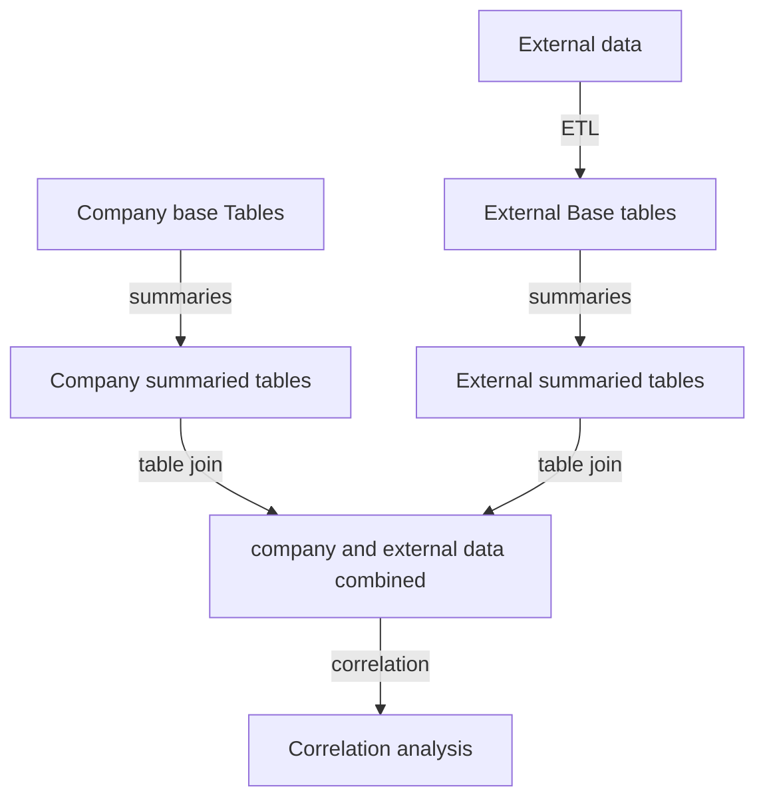

# correlate-data
Correlate a company data with external data (correlate data)
Problem: Business intelligence (BI) or customer relationship management (CRM) software provides data on regional sales but lacks comprehensive details about the region, which is necessary to understand variations in sales by region. Furthermore, when traveling, house hunting, or starting a business in a specific region, it is essential to obtain more in-depth information about that area.

Solution: Provide comprehensive regional details, including crime rates, education levels, environmental conditions, and local economic factors. This information can be integrated with BI (Business Intelligence) or CRM (Customer Relationship Management) data to identify potential correlations or discrepancies.

DataJoin.net provides in-depth education and consultation on matching CRM data with regional open-source information.

milan@datajoin.net
http://datajoin.net

## Flowchart  
